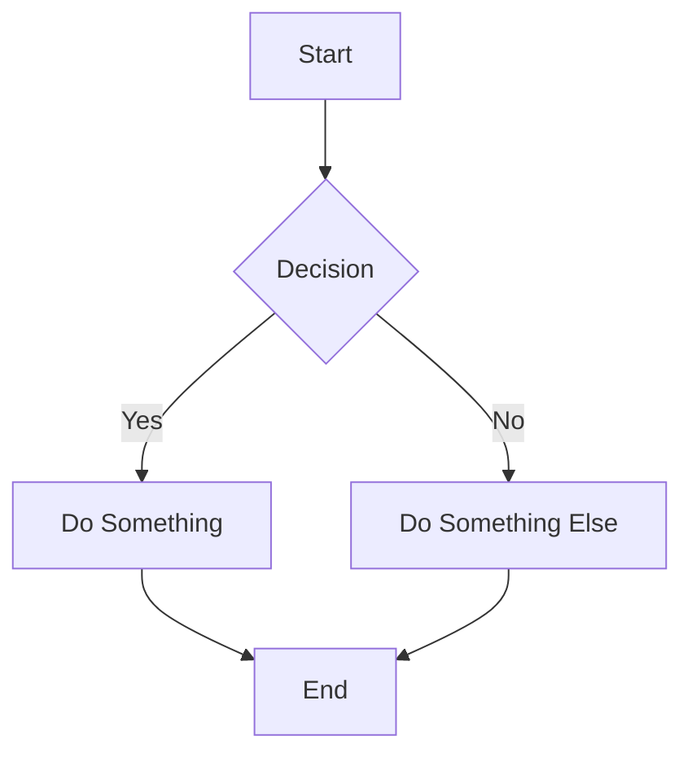
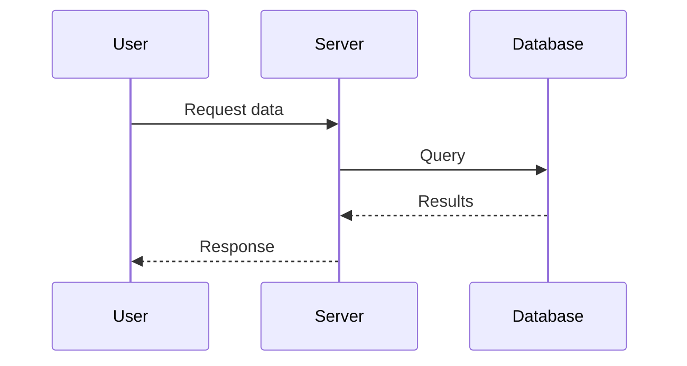
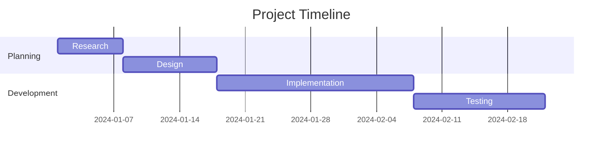
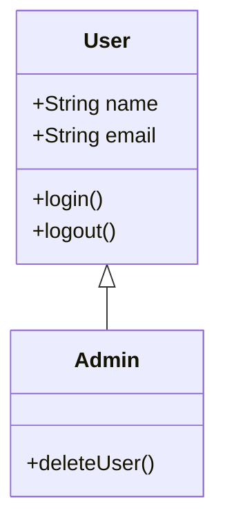
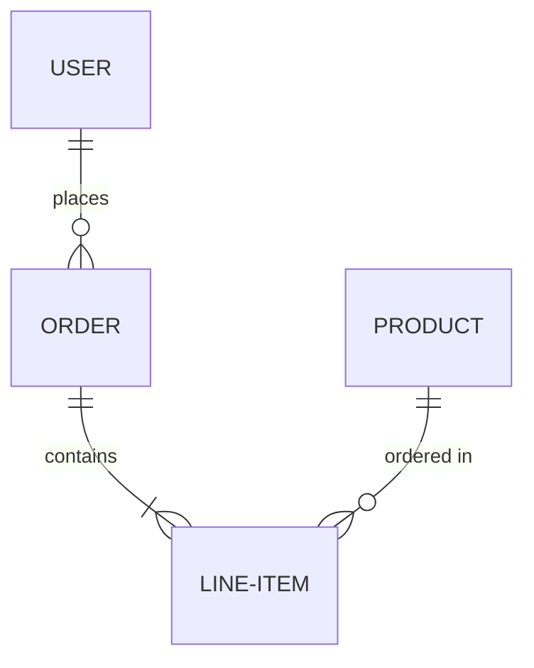

Mermaid diagrams create visual diagrams using simple text syntax. Support for flowcharts, sequence diagrams, Gantt charts, and more.

## Usage

Insert a mermaid diagram using the `/` menu:

```
/mermaid
```

Or use the component tag:

```
<mermaid />
```

## Features

- **Multiple diagram types** - Flowcharts, sequences, Gantt, ER diagrams, etc.
- **Syntax validation** - Real-time error checking
- **Adjustable size** - 5 size options
- **Copy code** - Copy mermaid code to clipboard
- **Border toggle** - Show/hide border
- **Edit mode** - Modal editor with syntax help
- **Auto-paragraph** - Automatically creates paragraph after diagram

## Attributes

| Attribute | Type | Default | Description |
|-----------|------|---------|-------------|
| `code` | string | `"graph TD\n A[Start] --> B[End]"` | Mermaid diagram code |
| `size` | string | `"md"` | Diagram size: `"sm"`, `"md"`, `"lg"`, `"xl"`, or `"full"` |
| `showBorder` | boolean | `true` | Whether to show border |

## Diagram Sizes

- **Small (`sm`)**: 300px max width, 200px max height
- **Medium (`md`)**: 500px max width, 300px max height
- **Large (`lg`)**: 700px max width, 400px max height
- **Extra Large (`xl`)**: 900px max width, 500px max height
- **Full (`full`)**: 100% width, 600px max height

## Editing Diagrams

In edit mode, hover over the diagram to see the toolbar:

1. **Edit** - Open the mermaid code editor
2. **Border toggle** - Show/hide border
3. **Copy** - Copy mermaid code

## Diagram Types

### Flowchart



### Sequence Diagram



### Gantt Chart



### Class Diagram



### Entity Relationship Diagram



## Implementation Details

### Node Spec

```typescript
// mermaid.tsx:15-47
export const mermaidNodeSpec: NodeSpec = {
  group: "block",
  content: "text*",
  marks: "",
  code: true,
  attrs: {
    code: { default: "graph TD\n    A[Start] --> B[End]" },
    size: { default: "md" },
    showBorder: { default: true },
  },
  selectable: true,
  parseDOM: [
    {
      tag: "mermaid",
      getAttrs: (dom) => ({
        code: dom.textContent || "graph TD\n    A[Start] --> B[End]",
        size: dom.getAttribute("size") || "md",
        showBorder: dom.getAttribute("showBorder") !== "false",
      }),
    },
  ],
}
```

### Mermaid Initialization

```typescript
// mermaid.tsx:50-71
mermaid.initialize({
  startOnLoad: false,
  theme: "dark",
  securityLevel: "loose",
  fontFamily: "ui-monospace, SFMono-Regular, 'SF Mono', Consolas, monospace",
  flowchart: {
    useMaxWidth: true,
    htmlLabels: true,
    curve: "cardinal",
  },
  gantt: {
    useMaxWidth: true,
    fontSize: 11,
  },
  sequence: {
    useMaxWidth: true,
  },
  themeVariables: {
    fontSize: "12px",
    fontFamily: "ui-monospace",
  },
});
```

### Rendering Diagrams

**Code reference:** `components/mermaid.tsx:336-390`

```typescript
useEffect(() => {
  const renderDiagram = async () => {
    if (!diagramRef.current) return;
    
    try {
      setError(null);
      diagramRef.current.innerHTML = "";
      
      // Generate unique ID
      const id = `mermaid-${Math.random().toString(36).substr(2, 9)}`;
      
      // Parse and render
      const { svg } = await mermaid.render(id, code);
      diagramRef.current.innerHTML = svg;
      
      // Style the SVG
      const svgElement = diagramRef.current.querySelector("svg");
      if (svgElement) {
        svgElement.removeAttribute("width");
        svgElement.removeAttribute("height");
        
        const sizeStyles = getDiagramSizeStyles(size);
        svgElement.style.maxWidth = "100%";
        svgElement.style.maxHeight = sizeStyles.maxHeight;
        svgElement.style.width = "100%";
        svgElement.style.height = "auto";
        svgElement.style.display = "block";
        
        svgElement.setAttribute("preserveAspectRatio", "xMidYMid meet");
      }
    } catch (err) {
      setError(err instanceof Error ? err.message : "Invalid mermaid syntax");
      // Display error in diagram area
    }
  };
  
  renderDiagram();
}, [code, size]);
```

### Size Styles

```typescript
// mermaid.tsx:237-252
function getDiagramSizeStyles(size: string) {
  switch (size) {
    case "sm":
      return { maxWidth: "300px", maxHeight: "200px" };
    case "md":
      return { maxWidth: "500px", maxHeight: "300px" };
    case "lg":
      return { maxWidth: "700px", maxHeight: "400px" };
    case "xl":
      return { maxWidth: "900px", maxHeight: "500px" };
    case "full":
      return { maxWidth: "100%", maxHeight: "600px" };
    default:
      return { maxWidth: "500px", maxHeight: "300px" };
  }
}
```

### Editor Modal

**Code reference:** `components/mermaid.tsx:73-234`

The modal includes:

```typescript
interface MermaidEditModalProps {
  open: boolean;
  initialCode: string;
  initialSize?: string;
  onCloseAction: () => void;
  onSubmitAction: (code: string, size?: string) => void;
}
```

Features:
1. **Mermaid Code** textarea (minimum 200px height)
2. **Diagram Size** dropdown
3. **Syntax validation** on submit
4. **Error display** with helpful messages
5. **Keyboard shortcuts** (Ctrl+Enter to submit, Escape to cancel)

### Auto-paragraph After Diagram

Diagrams automatically ensure a paragraph exists after them:

**Code reference:** `components/mermaid.tsx:498-539`

```typescript
export function insertMermaid(state: EditorState): Transaction {
  const { from, to } = state.selection;
  
  const attrs = {
    code: "graph TD\n    A[Start] --> B[End]",
    size: "md",
    showBorder: true,
  };
  
  const mermaidNode = state.schema.nodes.mermaid.create(
    attrs,
    state.schema.text(attrs.code)
  );
  
  let tr = state.tr;
  if (from !== to) {
    tr = tr.delete(from, to);
  }
  tr = tr.replaceSelectionWith(mermaidNode);
  
  const insertPos = from;
  const insertedNode = tr.doc.nodeAt(insertPos);
  
  if (insertedNode) {
    const afterPos = insertPos + insertedNode.nodeSize;
    const isLastNode = afterPos >= tr.doc.content.size;
    const nextNode = !isLastNode ? tr.doc.nodeAt(afterPos) : null;
    
    // If last node or next isn't a paragraph, insert one
    if (isLastNode || (nextNode && nextNode.type.name !== "paragraph")) {
      const emptyParagraph = state.schema.nodes.paragraph.create();
      tr = tr.insert(afterPos, emptyParagraph);
      tr = tr.setSelection(Selection.near(tr.doc.resolve(afterPos + 1)));
    }
  }
  
  return tr;
}
```

## Syntax Help

The editor includes a link to [mermaid.js.org](https://mermaid.js.org/) for syntax reference.

## Use Cases

1. **Architecture diagrams** - System design and architecture
2. **Workflows** - Process flows and state machines
3. **API flows** - Request/response sequences
4. **Project planning** - Gantt charts and timelines
5. **Database schemas** - ER diagrams
6. **Class hierarchies** - UML class diagrams